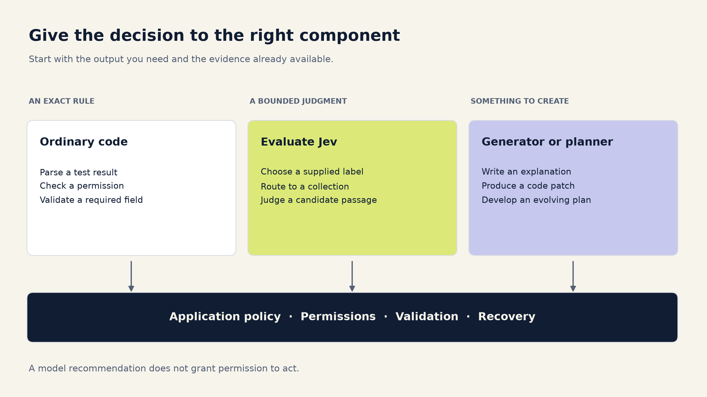
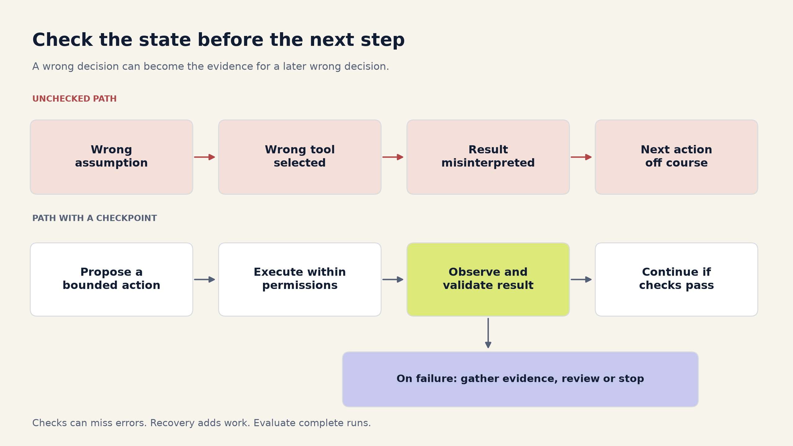
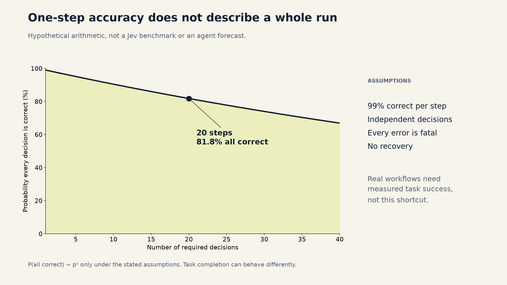
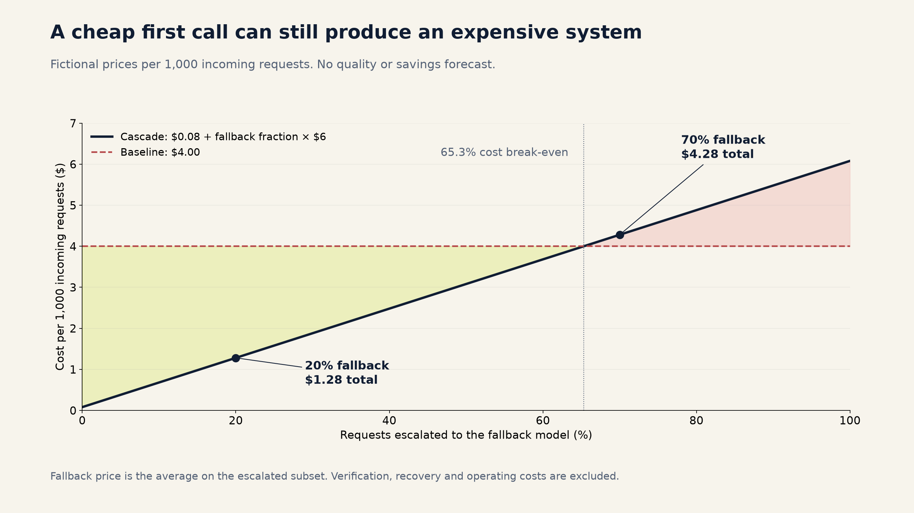

# When should you use JEV? A practical guide

By Saurabh Kumar · [@drummatick](https://x.com/drummatick)

A support ticket lands in the wrong queue. Someone moves it.

A coding agent chooses the wrong recovery action after a failed database migration. The next five steps now begin from a bad assumption.

Both decisions could be expressed as a single label. Their consequences are very different.

That is the useful starting point for Jev, TypeSafe's structured decision model. A cheaper decision is attractive when you make thousands of them. Whether you should automate that decision depends on what happens after it is wrong, how quickly you can notice, and what recovery costs.

This guide walks through that choice for search, coding, agents, support, document processing, and other everyday workloads. The architectures are proposals to evaluate. The numerical examples are hypothetical, not measurements of Jev.

## Start with the decision you actually need

Inside a large AI task, there are often much smaller questions:

- Which of these tools is relevant?
- Which collection should this query search?
- Which existing document supports this claim?
- Which team should receive this ticket?
- Does this case need more information before anything happens?

Jev is designed for structured decisions. TypeSafe's API offers Choice for selecting an option, Score for rating against a rubric, and Noul for a yes/no probability. Choice and Score also return distributions and confidence. It does not generate the explanation, patch, or answer paragraph that a general-purpose language model would write. [TypeSafe's primitive definitions](https://docs.typesafe.ai/primitives)

That gives you a useful boundary. Jev can help choose among candidate actions, documents or values that your application supplies. Another component still retrieves those documents, executes an authorized action, or generates new content.

Before adding any model, check whether ordinary code already knows the answer. A missing required field, a failed checksum, an expired permission and a compiler exit code are deterministic facts. A model call would add uncertainty to a decision you can already make exactly.

For decisions that need interpretation, ask three questions:

**Can you describe the possible answers?** Include a way to say that none fits. A model forced to choose among incomplete options can return a valid answer to the wrong question.

**Does the input contain enough evidence?** A confident choice cannot retrieve an account balance, discover a missing document or infer a business policy that was never supplied.

**Can you contain the mistake?** Reordering a shortlist is different from permanently removing candidates. Suggesting a tool is different from granting it permission to act.



## Where it is worth evaluating

The opportunities are broader than simple topic classification. The important distinction is the responsibility you give the decision.

| Workload | A bounded job for Jev | What still needs another mechanism |
|---|---|---|
| Customer support | Pick a queue or suggest a response template | Resolve the case and authorize account changes |
| Search routing | Choose a collection or search strategy | Retrieve documents and check access permissions |
| Search ranking | Judge relevance within a retrieved shortlist | Preserve recall and evaluate ranking quality |
| RAG | Select or flag evidence passages | Generate the answer and verify its claims |
| Coding | Classify an issue or prioritize test suites | Write the patch, run tests and review changes |
| Agent tool selection | Recommend a tool from a small registry | Validate arguments, permissions and actual results |
| Model routing | Assign a task to an evaluated specialist | Detect routing mistakes and measure final quality |
| Document processing | Select among extracted candidate values | OCR, parse, validate and preserve source spans |
| Catalog matching | Judge a small set of possible matches | Retrieve candidates and control record merges |
| Content moderation | Prioritize review or assign a policy category | Measure missed harms and handle appeals |
| Observability | Group alerts or suggest an owning service | Preserve paging rules and diagnose the incident |
| Recommendations | Score a retrieved set against preferences | Generate candidates and measure user outcomes |
| Batch analytics | Apply a stable taxonomy to many records | Audit rare categories and track drift |
| Workflow intake | Choose a predefined workflow | Check eligibility and enforce business rules |

These are candidate applications, not evidence that Jev beats a rule, an embedding model, a trained classifier or a larger LLM on every row. Compare the simplest credible alternatives for your workload.

## Search: be careful what you throw away

Suppose someone searches, “Can I cancel while an invoice is unpaid?”

You could ask Jev whether the query belongs in billing, subscriptions or account management. That is a small decision. But an incorrect route can hide the one document containing the cancellation exception.

A practical first design is to let the router suggest a primary collection while preserving a broader search path for ambiguous queries. Measure whether relevant evidence reaches the candidate set. A fast router that consistently searches the wrong collection has made every downstream component's job harder.

Once you have candidates, you can evaluate Jev as a relevance judge. Retrieval and reranking are different stages; keyword and vector retrieval can also be combined before a model sees the shortlist. Microsoft's search documentation describes this separation, and TypeSafe publishes a Jev reranking example. Neither establishes which combination will work best on your content. [Hybrid retrieval and ranking](https://learn.microsoft.com/azure/search/hybrid-search-ranking), [TypeSafe reranking example](https://docs.typesafe.ai/cookbooks/rerank_typesafe)

Prefer reordering candidates before trying aggressive deletion. If a useful passage moves from position two to position six, a downstream reader may still recover it. If it is filtered out, the answer generator cannot use it at all.

For RAG, also distinguish “this passage answers the question” from “this passage is trustworthy” and “the user is allowed to see it.” Those are separate checks. A document can be relevant and outdated, or relevant and inaccessible to this user. Contradictory evidence may deserve inclusion precisely because it changes the answer.

Your evaluation should follow the whole path: candidate recall, ranking quality, evidence retained, final answer quality, latency and total cost. Cost per passage alone misses the expensive mistake: producing a polished answer from the wrong evidence.

## Coding: prioritize work before you delegate judgment

There are useful small decisions around code generation. An incoming issue might concern authentication, the database, the frontend or documentation. A diff might suggest which additional test suites to prioritize. A failure log might need routing to the right owner.

Those jobs have bounded outputs. Writing a patch for an unfamiliar codebase does not.

Consider test selection. A router recommends running the authentication integration suite after a session-management change. That can be useful. Letting the same router skip every other regression check introduces a different failure mode: a missing test produces no red signal at all.

Begin with test prioritization while retaining required checks. Measure how often relevant failing tests are missed, how quickly failures are discovered, and whether developer waiting time actually improves. If you later remove tests, evaluate the resulting change in escaped defects, not just the number of tests avoided.

Keep machine-observable facts in code. Parse the test runner's result instead of asking a model whether the tests passed. Check that a patch applies. Run the compiler. Compare the files actually changed with the intended scope.

Some facts remain semantic: whether the patch solves the reported bug, whether a test covers the important behavior, or whether a migration preserves the intended data. Jev might supply a signal for one of those judgments, but a score should not become the only release criterion.

You can also route coding tasks between generators. A documentation edit and a concurrency bug may deserve different resources. Evaluate that router against the completed work, including repair attempts. If a cheap initial route creates three extra repair cycles, its first-call saving tells you very little.

## Agents: one wrong turn can change the next question

An agent that repeatedly observes, chooses a tool, executes it and observes again has a special problem: its own decisions change the inputs it will see next.

Imagine an agent investigating a failed payment integration. It mistakes an authentication failure for an expired subscription, chooses an account-management tool, and then interprets the returned account data as confirmation. The subsequent actions can be internally consistent while solving the wrong problem.

This is why evaluating isolated tool choices is useful but incomplete. A valid tool name does not establish that the tool is appropriate. Valid arguments do not establish that the action is authorized. A successful API response does not establish that the user's goal has been met.

TypeSafe demonstrates bounded skill selection as an application. That is a sensible unit to test: the system supplies a catalog and can reject the suggested skill. It does not establish the reliability of the entire agent using that suggestion. [Skill-selection example](https://docs.typesafe.ai/cookbooks/skill_suggestion)

Give a decision model a small, observable responsibility first. It might choose which read-only diagnostic to try, select a relevant skill, or decide that more information is needed. Keep permissions, action budgets, stop conditions and consequential writes in application logic.

After each action, inspect the result that actually occurred. If a tool failed or the state is inconsistent, stop, gather evidence or take a recovery path. Repeating the same judgment against the same missing evidence is not much of a recovery strategy.



Here is a deliberately simplified illustration. If a task requires 20 independent decisions, every decision has 99% probability of being correct, every mistake is fatal, and there is no recovery, the chance that all 20 are correct is 0.99 raised to the twentieth power, or about 81.8%.

That is arithmetic under assumptions, not an estimate of Jev's agent performance. Real tasks have dependencies, recoverable mistakes and different definitions of success. You cannot plug a model's average classification accuracy into that formula and call the result an agent benchmark.

The operational question is whether complete runs finish correctly, how failures unfold, and what recovery costs. Anthropic's agent guidance also identifies compounding errors and the need for testing complete agent systems. [Building effective agents](https://www.anthropic.com/engineering/building-effective-agents)



## More places to use the same reasoning

**Support triage.** Start by recommending queues to agents who can correct them. Measure rerouting and time to resolution. Routing a refund request is a different responsibility from approving the refund. Keep eligibility and account authorization separate from intent classification.

**Documents and extraction.** A parser can collect candidate dates, amounts or reference numbers. Jev can help select which candidate has the requested meaning, and code can return the original span. TypeSafe documents this pattern. Preserve the source location, handle “not present,” and use arithmetic or domain rules to validate the result. A correctly copied number can still be the wrong number. [Candidate-value extraction](https://docs.typesafe.ai/cookbooks/pre_parsed_value_extraction_cookbook)

**Catalog matching.** Retrieve plausible products, then ask whether a pair describes the same item. Suggesting matches for review is reversible. Merging records may spread an error into inventory, pricing and reporting. Measure false merges separately from missed matches, and keep the merge operation behind its own policy.

**Moderation.** Prioritizing a review queue can be evaluated before automating enforcement. A useful overall accuracy number may hide poor performance on rare but consequential categories. Measure false negatives and false positives by policy category and relevant traffic segment. A content score alone should not be treated as proof that adversarial input is harmless.

**Alert routing.** Jev might group related alerts or suggest an owner from a service catalog. Keep deterministic paging rules for critical signals. An incorrectly grouped alert can delay an investigation, so evaluate missed incidents and time to useful action as well as duplicate reduction.

**Recommendations and personalization.** A bounded judge can score a retrieved set against supplied preferences. Evaluate the recommendations people actually see. Filtering changes exposure, and repeated feedback can reinforce the initial selection. A plausible preference score is not a substitute for measuring the user outcome.

**Batch classification.** This is attractive when a taxonomy is stable and the volume is large. Sample uncertain cases and a random slice of accepted cases for review. Review only the uncertain cases and you will miss confident mistakes. Keep an unknown category, examine rare labels separately, and compare the running cost with simpler classifiers before building a cascade.

## Confidence has to earn its place in the workflow

TypeSafe describes confidence as a statistic derived from the shape of the returned probability distribution. It is a useful candidate routing signal. A value of 0.9 does not, by itself, prove 90% correctness on your traffic. [Confidence documentation](https://docs.typesafe.ai/confidence)

Evaluate what happens when your application accepts answers above a threshold. Two measurements belong together:

**Coverage:** how much traffic the system handles automatically.

**Accepted-error rate:** how often those automatically handled cases are wrong.

Track them by action and error type, not only in aggregate. A threshold that works for routing a support queue may be inappropriate for a consequential account action. Also measure the cases sent elsewhere: fallback quality is a property of that selected subset.

This is a selective-prediction problem: you are choosing which decisions to accept and which to defer. The research language is a risk–coverage trade-off. That framing does not guarantee Jev's confidence will separate your easy and hard cases; you have to measure it. [SelectiveNet](https://proceedings.mlr.press/v97/geifman19a.html)

Confidence also cannot repair missing options or missing facts. “Ask for clarification,” “none of these,” and “fetch the relevant record” can be better routes than asking a larger model to guess from the same incomplete input.

## A cascade pays for the first model on every request

A common design is simple: accept an inexpensive decision when the policy allows it, and otherwise use a stronger model, another retrieval step or a person.

The cost accounting has to follow the path each request takes:

```text
Mean cascade API cost
  = mean Jev cost across all requests
  + fallback fraction × mean fallback cost on escalated requests
```

Use the cost of the escalated requests, not the larger model's average cost on all traffic. The selected cases can have longer context, more reasoning, extra tool calls or retries. They can also be cheaper; measure the conditional workload instead of assuming either direction.

For a planning example, invent three prices: the original model costs $4 per 1,000 requests; the decision stage costs $0.08 per 1,000 incoming requests; the selected fallback workload costs $6 per 1,000 escalations. These are fictional prices, not Jev pricing or benchmark results.

| Fraction escalated | Cascade API cost per 1,000 incoming requests | Change versus the $4 baseline |
|---|---:|---:|
| 20% | $1.28 | 68% lower |
| 60% | $3.68 | 8% lower |
| 70% | $4.28 | 7% higher |

The first stage stays cheap in every row. The total saving does not.

You can change these hypothetical prices and fallback rates in the [cascade cost calculator](calculator.html).



For the product decision, go beyond the token bill. Include verification, retrieval, retries, human review and the operating work of maintaining the additional path. For agents, compare total spend divided by successfully completed tasks, and report completion rate and serious failures beside it. A low cost per success does not excuse abandoning an unacceptable share of tasks.

Latency needs the same treatment. A sequential fallback pays for the first stage before the second can start. Even if the common path becomes faster, the slowest requests can become slower. Measure the end-to-end distribution rather than adding independently measured percentiles.

## Keep the model's recommendation separate from permission to act

A minimal Choice request can look like this. It asks for a search route, including an explicit uncertainty option:

```python
request = {
    "model": "jev-1.13.0",
    "state": "Where is the refund policy for a canceled annual plan?",
    "questions": {
        "route": {
            "type": "choice",
            "instructions": "Choose the relevant search collection.",
            "criteria": {
                "billing": "Invoices, refunds, charges and payment policies",
                "product": "Product behavior, features and setup instructions",
                "unknown": "Missing context or no clear matching collection",
            },
        }
    },
}
```

The [HTTP reference](https://docs.typesafe.ai/api) documents the request and response contract. The companion adapter pins the model, checks the returned version, bounds network reads, and turns transport or contract failures into explicit failure signals. It reads the key from the environment only when you explicitly run the live example.

The decision policy should then be ordinary, inspectable code. For example:

```python
if choice == "unknown":
    return ask_for_more_information()

if choice not in automatic_actions:
    return request_review(choice)

if confidence < thresholds[choice]:
    return use_fallback_and_check_its_result()

return recommend(choice)
```

This is policy pseudocode, not an authorization system. The [runnable companion](code/README.md) includes a tested implementation that returns recommendations, an offline demo, an optional Jev HTTP adapter, and per-item cost accounting. Its fallback cannot promote a review-only action to automatic execution. No example executes a tool, transfers money or modifies an account.

Thresholds in the demo are explicitly illustrative. Your deployed thresholds need evidence from your own data. A larger model's answer must still pass the application's policy, and its agreement with another model does not make either one ground truth.

## Decide with a small, complete evaluation

Choose one decision with a clear owner and a useful outcome. Write down what counts as an unacceptable mistake before comparing bills. Where errors have very different consequences, set separate limits instead of averaging them into one score.

Collect representative inputs, including ambiguity, missing information, unfamiliar categories and the failures your application already encounters. Preserve enough context to make the decision, while sending only data you are permitted to process. For agents, include complete task episodes and the changing state after each action.

Compare rules or simpler models, Jev alone, the stronger baseline, and the proposed cascade. Keep prompts, available evidence, output requirements and operational budgets explicit. A label-only classifier and a system asked to produce a justification plus scores are doing different amounts of work.

Use one subset to choose the policy and another to evaluate it. Keep related records or task episodes together so that near-duplicates and steps from the same run do not leak across that boundary. Report failures and unresolved tasks in the denominator. Measure the selected fallback subset directly. Include uncertainty and enough examples of rare consequential errors to make the acceptance decision meaningful.

Then run the real pipeline in shadow mode. It should produce recommendations without changing the user-visible outcome. Check actual latency, outages, schema handling and intervention rates. Once the quality target is met, compare the saving with the cost of operating the extra component.

If you deploy, keep auditing accepted answers as well as escalations. Changes to the model version, taxonomy, context, tool registry or incoming traffic can change the decision boundary. Roll back when a predeclared operating limit is exceeded.

The best first use for Jev is a small decision whose consequences you can observe. Give it more responsibility only as the evidence supports it. A cheap decision becomes useful when the system around it can recognize, contain and recover from the expensive mistake.

---

*Companion materials: [code and offline demo](code/README.md), [technical notes and evaluation worksheet](TECHNICAL_NOTES.md), [interactive planning calculator](calculator.html), and [sources with claim boundaries](SOURCES.md). The calculator and plots use synthetic assumptions. No study results or customer data are included.*
